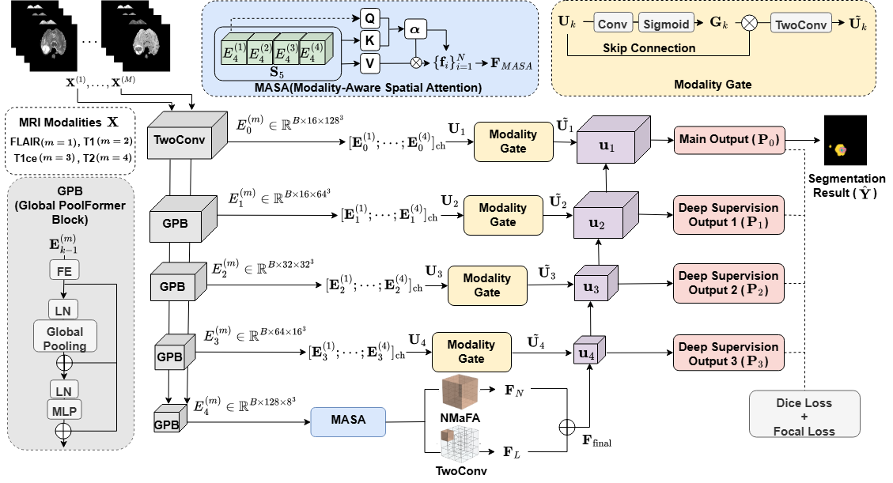
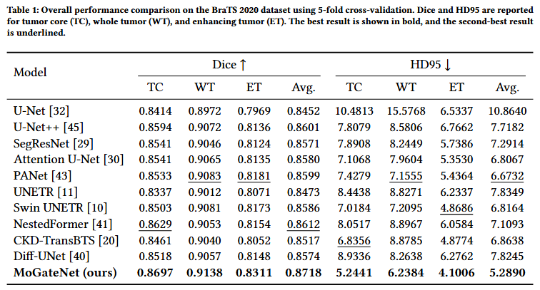
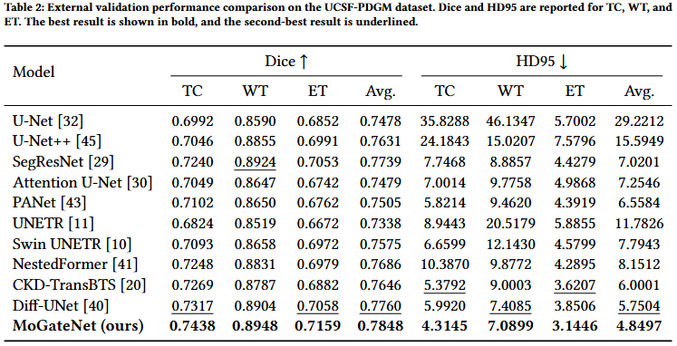

# MoGateNet

**MoGateNet: Modality-Aware Gated Network for Multimodal MRI-Based Brain Tumor Segmentation**

This is an anonymous implementation of the CIKM 2026 submission, **"MoGateNet: Modality-Aware Gated Network for Multimodal MRI-Based Brain Tumor Segmentation"**.

## Contribution

MoGateNet focuses on improving multimodal MRI-based brain tumor segmentation by addressing the limitation of conventional multimodal fusion strategies. Existing methods commonly concatenate multiple MRI modalities or fuse them uniformly, which may fail to fully exploit modality-specific information across heterogeneous tumor subregions and irregular tumor boundaries.

To address this issue, we propose a modality-aware 3D segmentation network that enhances feature fusion at both the bottleneck and skip-connection levels. MoGateNet consists of four modality-specific encoder branches, Modality-Aware Spatial Attention (MASA), NMaFA-based bottleneck refinement, Modality Gate-based skip refinement, and a decoder with deep supervision.

Extensive experiments on the BraTS 2020 dataset and external validation on the UCSF-PDGM dataset demonstrate the effectiveness and generalization ability of MoGateNet.

## Architecture

<p align="center">
  
</p>

## Data Preparation

Please download the BraTS 2020 and UCSF-PDGM datasets from their official sources.

Each case should include four MRI modalities, FLAIR, T1, T1ce, and T2, along with the corresponding segmentation label. Due to dataset redistribution restrictions, the datasets are not included in this repository.

The input modalities should be ordered as follows:

```text
FLAIR, T1, T1ce, T2
```

The datalist JSON file should follow a MONAI-style format:

```json
{
  "training": [
    {
      "image": [
        "case_001_flair.nii.gz",
        "case_001_t1.nii.gz",
        "case_001_t1ce.nii.gz",
        "case_001_t2.nii.gz"
      ],
      "label": "case_001_seg.nii.gz",
      "fold": 0
    }
  ]
}
```

## Training

After the data is prepared, you can train the model using the following command:

```bash
python main.py \
  --data_dirs ./TrainingData \
  --json_list ./brats2020_datajson.json \
  --fold 0 \
  --logdir mogatenet_fold0
```

For 5-fold cross-validation, repeat the training by setting `--fold` to `0`, `1`, `2`, `3`, and `4`.

## Evaluation

The evaluation reports Dice and HD95 scores for TC, WT, and ET.

- TC: tumor core
- WT: whole tumor
- ET: enhancing tumor

During inference, only the main decoder output is used. Deep supervision outputs are used only during training.

## Experiment Results

Here are the main results on the BraTS 2020 dataset:

<p align="center">
  
</p>

External validation results on the UCSF-PDGM dataset are shown below:

<p align="center">
  
</p>

## Note

The datasets are not redistributed in this repository. Please download them from their official sources and organize them according to the datalist format above.
